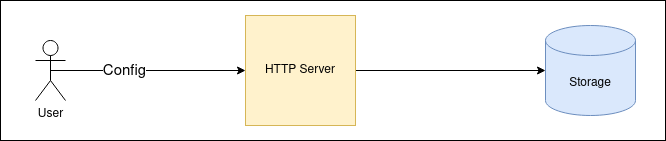
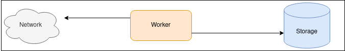
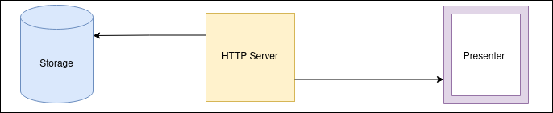

[OBSERVATORY LANDING PAGE](../../README.md) | [TO ADRs List](./index.md)

### Title
# Choose Architecture Design (Jan 26, 2024)

## Status

proposed, **accepted**, rejected, deprecated, superseded

## Context

Application plays multiple roles:
- Worker. It makes calls to multiples endpoints in the same time and throug out long period of time.
- Storage. It collects all needed information localy or in the memory.
- Analizer. It compute and group needed information according to needes.
- Presenter. It provides results of grouped information. Would be good to see a chart(s) in web browser.

## In consideration

1. Layered architecture
2. MVC - rejected. (MVC is too complicated for this application, hence it will be difficult develop it and use it as a portable application)
3. Service-oriented architecture - rejected. (excessive for this purpose)

## Decision :star:

#### Layered architecture.

Consists of the next layers:
- HTTP server (set up new endpoints, route web pages to present a result)
- worker (due to a list of endpoints it makes calls) and passes information to a storage. Computes results.
- presenter (view) (draws results as a chart(s) and/or statuses for appropriate endpoints)
- storage

Each layer works independently with personal role and responsibility.

- HTTP server layer is a server module.

Resposibility: route HTTP requests, process server information (server status, logs, etc.), render UI templates, connects to the storage for getting needed information for representation.

- worker layer is a worker module

Resposibility: according to configuration list it makes requests to appropriate endpoints/IPs, calculate and send needed information to the storage.

- presenter layer - ui module

Is a module which consists of HTML pages.

Resposibility: render onformation from the storage.

- storage is a storage module

In memory collection or file with appropriate data. It should be restricted with allocated memory. The size will be discussed.

Responsibility: collect data in specific order and evict old data.

## Schemas

## Positive Consequences

Whole application is kept in one place. It is portable. It is easy configurable. It is possible to ammend configuration file manualy.

## Negative Consequences

Looks messy.

## Links

- no links yet
